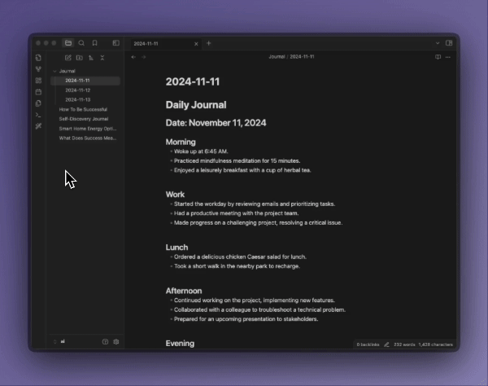
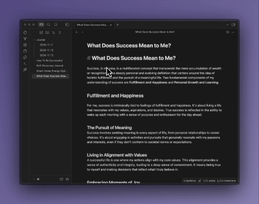

# 🪄 AI Tagger
AI Tagger is an Obsidian (https://obsidian.md) plugin that simplifies tagging by using various Large Language Models (LLMs) to analyze and tag your document with one click! 

The plugin analyzes the current document that you have open in the editor and all of the previous tags that you have used. AI tagger will return up to 5 relevant tags that you have previously used and will generate up to 3 completely new tags.

## 🤖 Supported AI Models

| Provider | Model | Token Limit | Type |
|----------|--------|-------------|------|
| OpenAI | GPT-4o mini | 128K | Closed Source |
| OpenAI | GPT-4o | 128K | Closed Source |
| Mistral AI | Mistral Small | 32K | Closed Source |
| Mistral AI | Mistral Large | 128K | Closed Source |
| Mistral AI | Mistral Nemo | 128K | Open Source |
| Anthropic | Claude 3.5 Haiku | 200K | Closed Source |
| Anthropic | Claude 3.5 Sonnet | 200K | Closed Source |
| Anthropic | Claude 3 Opus | 200K | Closed Source |
| Google | Gemini 1.5 Flash | 1M | Closed Source |
| Google | Gemini 1.5 Flash-8B | 1M | Closed Source |
| Google | Gemini 1.5 Pro | 1M | Closed Source |
| Groq | Llama 3 Groq 8B | 8K | Open Source |
| Groq | Llama 3 Groq 70B | 8K | Open Source |
| Groq | Llama 3.1 8B | 128K | Open Source |
| Groq | Llama 3.1 70B | 128K | Open Source |
| Ollama | Llama 3.2 | 128K | Open Source |
| Ollama | Mistral Nemo | 128K | Open Source |
| Ollama | Qwen 2.5 | 128K | Open Source |

## 🚀 Setup

1. Install from Obsidian Community Plugins
2. Enter your chosen provider's API key in settings
3. Select your preferred model
4. Optional: Configure custom API endpoint (useful for Ollama or proxies)

## 📝 Usage

### One click tagging

- Click the "Wand" icon in the left sidebar to tag current note

    

### Selection-Based Tagging

- Highlight text and use Command Palette (Ctrl/Cmd + P) → "Generate tags"

    

### Batch Tagging

- Right-click file(s) or folders to tag multiple documents

    

## 🔧 Configuration Options

- Custom Endpoints: Set alternative API endpoints (default Ollama: http://localhost:11434)
- Lowercase Tags: Force all tags to lowercase
- Context Awareness: Plugin considers existing tags to avoid duplicates

    

## 🤝 Contributing

Found a bug? Have an idea? We'd love to hear from you:

🐛 Report a bug
💡 Request a feature
🔧 Submit a PR

## 📜 License

[MIT License](LICENSE)
